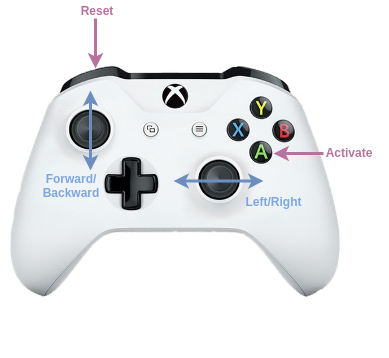

# BobbleBot - An Open Source ROS Robot
> Gazebo simulation of a self-balancing ROS robot.

One to two paragraph statement about your product and what it does.

<center>
<a href="http://www.youtube.com/watch?feature=player_embedded&v=hS7kfhN-8V8
" target="_blank"></a>
</center>

## Installation

TODO debian based install instructions.

```sh
npm install my-crazy-module --save
```

## Quick Start

A few motivating and useful examples of how your product can be used. Spice this up with code 
blocks and potentially more screenshots.

For more examples and usage, please refer to the [Wiki][wiki]._

## Keyboard Control
Here's how to control BobbleBot with the keyboard.

Launch the simulation using the command below.
```sh
roslaunch bobble_description run_sim.launch
```

In a separate terminal (with the ROS environment sourced) launch the keyboard control node using the 
command below.
```sh
rosrun bobble_description KeyboardControl
```

The controls are summarized below. The terminal used to launch the keyboard control node must 
have the active focus.
```sh
BobbleBot Keyboard Controller
---------------------------
Activate/Deactivate command:
    Activate/Shutdown: space bar
Moving around:
    Forward : w
    Backward : s
    Left : a
    Right : d
Speed Up/Down: 
    15% Increase: q
    15% Decrease: e
CTRL-C to quit
```

## Joystick Control
The bobble_description package comes with a Joystick control node that is defaulted with a mapping 
that is suitable for an Xbox 1 controller. To use joystick control, follow 
[these instructions](https://www.maketecheasier.com/set-up-xbox-one-controller-ubuntu/) 
to setup your Xbox 1 controller. Next, make sure you have the [ROS joy package installed](http://wiki.ros.org/joy). 
With those two steps out of the way, you can then launch the simulator using the command below.

```sh
roslaunch bobble_description run_sim_with_joystick.launch
```

The default controls are depicted below:




## Development setup

Describe how to install all development dependencies and how to run an automated test-suite of some kind. Potentially do this for multiple platforms.

```sh
make install
npm test
```

## Release History

* 0.2.1
    * CHANGE: Update docs (module code remains unchanged)
* 0.2.0
    * CHANGE: Remove `setDefaultXYZ()`
    * ADD: Add `init()`
* 0.1.1
    * FIX: Crash when calling `baz()` (Thanks @GenerousContributorName!)
* 0.1.0
    * The first proper release
    * CHANGE: Rename `foo()` to `bar()`
* 0.0.1
    * Work in progress

## Meta

Your Name – [@YourTwitter](https://twitter.com/dbader_org) – YourEmail@example.com

Distributed under the XYZ license. See ``LICENSE`` for more information.

[https://github.com/yourname/github-link](https://github.com/dbader/)

## Contributing

1. Fork it (<https://github.com/yourname/yourproject/fork>)
2. Create your feature branch (`git checkout -b feature/fooBar`)
3. Commit your changes (`git commit -am 'Add some fooBar'`)
4. Push to the branch (`git push origin feature/fooBar`)
5. Create a new Pull Request

<!-- Markdown link & img dfn's -->
[npm-image]: https://img.shields.io/npm/v/datadog-metrics.svg?style=flat-square
[npm-url]: https://npmjs.org/package/datadog-metrics
[npm-downloads]: https://img.shields.io/npm/dm/datadog-metrics.svg?style=flat-square
[travis-image]: https://img.shields.io/travis/dbader/node-datadog-metrics/master.svg?style=flat-square
[travis-url]: https://travis-ci.org/dbader/node-datadog-metrics
[wiki]: https://github.com/yourname/yourproject/wiki
